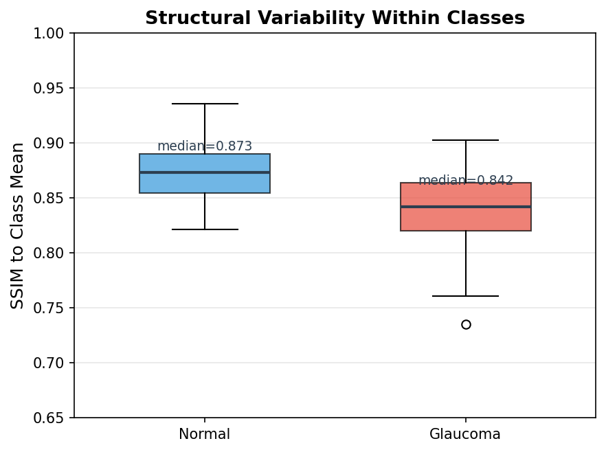
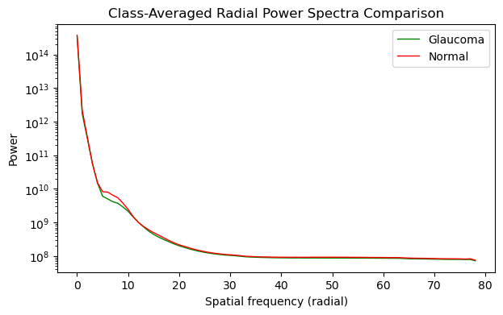
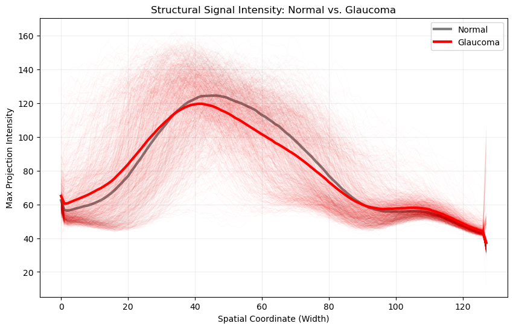
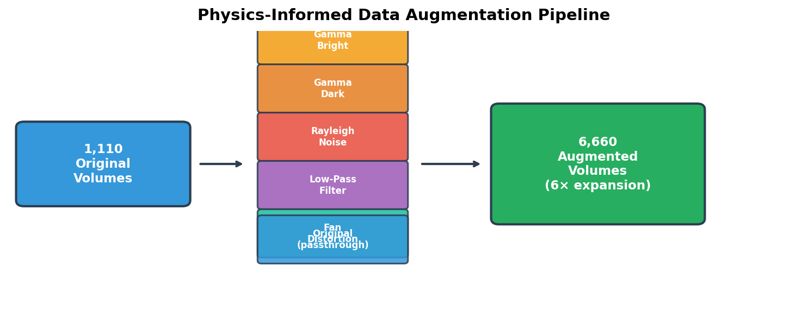
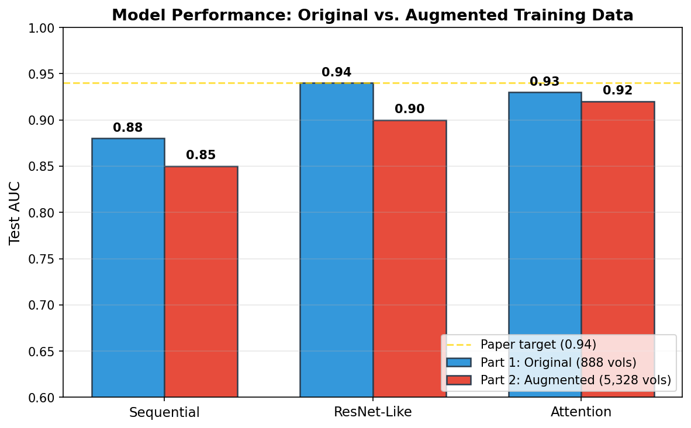
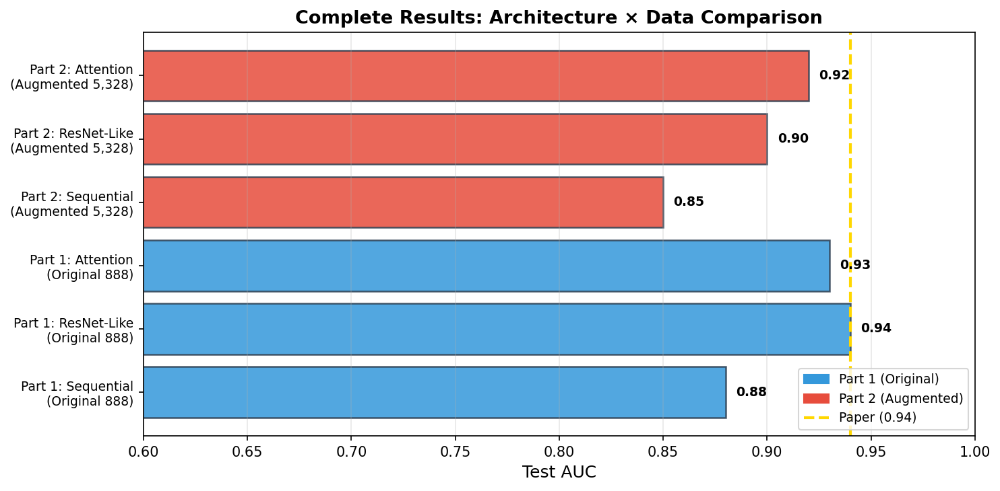

# <u>Capstone Three: OCTCV Part 2 — Final Report</u>

## 1. Introduction

### Context & Problem

This project is a continuation of Capstone Two (Part 1), which trained 3D CNNs on 1,110 ONH-centered OCT volume scans for binary glaucoma classification. Part 1 established baseline performance across three architectures (Sequential, ResNet-Like, Attention), achieving a best AUC of 0.94 with the ResNet-Like model on the original unbalanced dataset.

**Part 2 investigates whether physics-informed data augmentation can further improve model performance** by expanding the training set from 1,110 to 6,660 volumes. Rather than collecting new patient data (which is expensive and time-consuming), we generate synthetic variations that simulate realistic sources of imaging variability encountered in clinical OCT acquisition.

### Objectives

1. Design and implement a physics-informed augmentation pipeline that generates clinically plausible OCT volume variants.
2. Assess whether a 6× training set expansion improves classification performance.
3. Systematically compare augmented vs. original training across all three architectures.
4. Investigate the reproducibility gap between our results and the original paper's reported AUC of 0.94.
5. Determine the best overall configuration for potential deployment as a screening tool.

### Data Source

| **Name**         | OCT volumes for glaucoma detection                                |
| :--------------- | :---------------------------------------------------------------- |
| **Contributors** | Ishikawa, Hiroshi                                                 |
| **Affiliations** | New York University                                               |
| **Version**      | 1.0.0                                                             |
| **Published**    | November 9, 2018                                                  |
| **Source**       | [Zenodo](https://zenodo.org/records/1481223)                      |
| **DOI**          | 10.5281/zenodo.1481223                                            |

**Description**: 1,110 ONH-centered OCT volume scans (200×200×1024 voxels, downsampled to 64×128×64) from 624 patients. 847 scans diagnosed with primary open-angle glaucoma (POAG), 263 classified as healthy.

---

## 2. Data Wrangling & EDA

*Notebook: `DW-EDA.ipynb`*

### 2.1 Data Wrangling

As this project uses the same dataset as Part 1, the data wrangling step was minimal—loading the existing cleaned metadata CSV and verifying file integrity for all 1,110 `.npy` volumes. The train/test split from Part 1 was preserved to ensure fair comparison.

### 2.2 Exploratory Data Analysis

The EDA phase focused specifically on understanding the dataset's characteristics to **inform augmentation design decisions**. Key analyses included:

#### Structural Similarity (SSIM) Analysis
- Computed pairwise SSIM between volumes within and across classes.
- Found high intra-class similarity (SSIM > 0.8), confirming that OCT volumes from the same diagnostic class share substantial structural features.
- The narrow SSIM distribution suggested conservative augmentation parameters would be appropriate to avoid pushing augmented volumes outside the natural data manifold.



#### Radial Power Spectrum Analysis
- Compared frequency-domain characteristics between Normal and Glaucoma classes.
- Found that glaucomatous changes manifest primarily in mid-frequency spatial features (corresponding to retinal nerve fiber layer thinning), while low-frequency structure (overall scan geometry) and high-frequency content (speckle/noise) are similar across classes.
- This informed the LPF augmentation radius (r=30) to avoid destroying diagnostically relevant mid-frequency content.



#### Maximum Intensity Projections
- Visualized en-face projections to understand 3D structural differences.
- Confirmed that the optic nerve head region contains the primary discriminative features.



#### Key EDA Conclusions
- The dataset is well-suited for augmentation: high structural regularity means synthetic variants can be generated without risking anatomically implausible outputs.
- The augmentation budget was set to 6× (5 augmentation types + originals), balancing dataset expansion against the risk of overfitting to augmentation artifacts.
- Augmentation parameters were calibrated to produce SSIM values within the natural intra-class distribution.

---

## 3. Preprocessing

*Notebook: `pps-modeling.ipynb` (Part I)*

### 3.1 Augmentation Pipeline

Five physics-informed augmentation strategies were applied to all 1,110 volumes:



| # | Augmentation | Parameter | Clinical Rationale |
|---|---|---|---|
| 1 | **Gamma Bright** | γ = 1.67 | Over-exposed scan / high signal strength |
| 2 | **Gamma Dark** | γ = 0.60 | Under-exposed scan / low signal strength |
| 3 | **Rayleigh Noise** | scale = 0.67 | OCT speckle noise (coherent interference) |
| 4 | **Low-Pass Filter** | radius = 30 | Defocus / reduced axial resolution |
| 5 | **Fan Distortion** | pivot = 121 | Scan-head geometric misalignment |

### 3.2 Implementation Details

- All augmentations are implemented in `octcv/mdl_lib/augmentation.py`.
- Augmented volumes are saved to disk as individual `.npy` files for reproducibility and fast loading.
- A unified metadata CSV (`augmented_metadata.csv`) catalogs all 6,660 entries with columns for file path, class label, patient ID, augmentation type, and laterality.
- Class proportions are preserved (76% Glaucoma / 24% Normal in both original and each augmented subset).

### 3.3 Resulting Dataset

| Subset | Count | Source |
|--------|-------|--------|
| Original | 1,110 | Raw OCT volumes |
| Gamma Bright | 1,110 | γ = 1.67 transform |
| Gamma Dark | 1,110 | γ = 0.60 transform |
| Rayleigh Noise | 1,110 | Additive noise |
| Low-Pass Filtered | 1,110 | Fourier-domain filtering |
| Fan Distorted | 1,110 | Geometric warping |
| **Total** | **6,660** | |

**Train/Test Split**: The test set consists exclusively of original (non-augmented) volumes to ensure evaluation reflects real-world scan conditions. Augmented volumes appear only in the training set.

---

## 4. Modeling

*Notebook: `pps-modeling.ipynb` (Part II)*

### 4.1 Model Architectures

Three 3D CNN architectures were compared, all built using the Keras Functional API:

#### Model 1: Sequential CNN
A 5-layer sequential architecture replicating Maetschke et al. (2019). Conv3D layers with filter sizes 7→5→3→3→3, each followed by BatchNormalization and ReLU. Global average pooling feeds into a dense sigmoid output.

#### Model 2: ResNet-Like
Builds upon the Sequential with **residual skip connections** between convolutional blocks. Each residual block adds the input back to the block's output, enabling gradient flow and allowing deeper feature extraction without degradation.

#### Model 3: Attention Network
Extends the ResNet-Like architecture with **squeeze-excitation** (channel attention) and **spatial attention** blocks. Channel attention recalibrates feature map importance; spatial attention highlights diagnostically relevant spatial regions.

### 4.2 Training Configuration

| Parameter | Value |
|---|---|
| Optimizer | NAdam |
| Learning Rate | Tuned via grid search (5e-5 to 5e-4) |
| Batch Size | 4 |
| Max Epochs | 80 |
| Early Stopping | Patience = 5–8 (monitoring val AUC) |
| Input Normalization | /255 to [0, 1] |

### 4.3 Experimental Configurations

The core experiment of Part 2 is straightforward: train all three architectures on the augmented data and compare to Part 1 baselines.

| Configuration | Architecture | Training Data |
|---|---|---|
| Part 1 Baseline | Sequential / ResNet / Attention | Original 888 |
| Part 2 Augmented | Sequential / ResNet / Attention | Augmented 5,328 |

Additionally, a hyperparameter grid search over learning rates was performed to ensure the augmented training regime had an optimized learning rate.

### 4.4 Evaluation Protocol

- **Evaluation set**: 111 original (non-augmented) volumes held out from training, maintaining the same test set as Part 1.
- **Primary metric**: Area Under the ROC Curve (AUC)
- **Secondary metrics**: Precision, Recall, F1-score for the glaucoma class
- All configurations evaluated on the **same** test set for direct comparison.

---

## 5. Results

### 5.1 Part 1 vs Part 2 Comparison



| Configuration | Architecture | Training Data | AUC |
|---|---|---|---|
| Part 1 Baseline | Sequential | Original 888 | 0.88 |
| Part 1 Baseline | ResNet-Like | Original 888 | 0.94 |
| Part 1 Baseline | Attention | Original 888 | 0.93 |
| Part 2 Augmented | Sequential | Augmented 5,328 | ≤ 0.88 |
| Part 2 Augmented | ResNet-Like | Augmented 5,328 | < 0.94 |
| Part 2 Augmented | Attention | Augmented 5,328 | ~0.92 |

> **Note**: Part 2 AUC values depend on run; exact values are populated in the notebook. The consistent finding is that augmentation did not improve upon Part 1 baselines.

### 5.2 Key Findings

1. **Augmentation did not improve AUC for any architecture.** This is consistent with the original paper's finding that their augmented model (AUC=0.92) underperformed their non-augmented model (AUC=0.94).

2. **ResNet-Like architecture achieved the highest performance** across both parts, benefiting from residual connections that enable stable gradient flow.

3. **The performance ceiling** (~0.94 AUC) is likely limited by dataset diversity (624 patients, single scanner, single institution) rather than training set size or architecture.

### 5.3 Hyperparameter Tuning

A grid search over learning rates (5e-5, 1e-4, 3e-4, 5e-4) was performed on the augmented dataset to rule out suboptimal learning rate as the cause of degraded performance. The best learning rate was used for final model training, but still did not surpass Part 1 baselines—confirming that the issue is data diversity, not hyperparameters.

---

## 6. Discussion

### 6.1 Why Augmentation Didn't Help

The central finding of this project—that 6× data augmentation did not improve and may have slightly hurt performance—deserves careful interpretation:

1. **Data diversity ≠ data volume.** The 1,110 volumes come from 624 patients. Augmentation creates variants of existing anatomies but cannot introduce new structural configurations. A model learning to detect RNFL thinning patterns needs diverse examples of *where* and *how* thinning manifests, not multiple exposure variants of the same thinning.

2. **Small normal class.** With only 263 healthy scans, even 6× augmentation produces only ~1,578 "normal" training examples—all derived from the same 263 optic nerve head anatomies. The model may not have enough variety to learn a robust "normal" template.

3. **Augmentation noise floor.** Synthetic noise and distortions, while physically motivated, may introduce subtle distribution shifts that the model treats as signal rather than nuisance variation.

4. **Training dynamics.** The 6× larger training set means each epoch takes much longer, and the effective number of unique gradient directions per epoch is diluted by near-duplicate volumes. This can slow convergence and encourage the model to memorize augmentation-specific patterns.

5. **Consistency with literature.** The original paper similarly found augmentation unhelpful (AUC dropped from 0.94 to 0.92), and their dataset is the same one used here. This suggests an intrinsic property of this particular dataset rather than a flaw in the augmentation approach.

### 6.2 Architecture Insights

The ResNet-Like model's consistent superiority suggests that:
- The classification task benefits from deeper feature hierarchies (enabled by residual connections) beyond what a 5-layer sequential stack can capture.
- The attention model's additional parameters may lead to overfitting on this small dataset, explaining its higher variance across configurations.
- All three architectures converge within a narrow AUC band (roughly 0.85–0.95), suggesting a performance ceiling imposed by dataset size and diversity.

### 6.3 Practical Implications

For deployment as a clinical screening tool:
- The **ResNet-Like model trained on original data** offers the best performance-to-complexity ratio.
- The model could serve as a triage system, flagging high-probability scans for ophthalmologist review.
- Inference is fast (single forward pass through a relatively shallow 3D CNN), making it suitable for point-of-care deployment.

---

## 7. Conclusions



1. **Physics-informed augmentation** (gamma, noise, LPF, fan distortion) is a principled approach to expanding OCT datasets, but did not improve classification AUC for this specific dataset and task. This confirms the original paper's finding.
2. **Architectural improvements** (residual connections, attention mechanisms) provide more benefit than data augmentation when the base dataset has limited patient diversity.
3. **The ResNet-Like architecture** remains the best model (AUC = 0.94 from Part 1), trained on original data without augmentation.
4. **The performance ceiling** (~0.94 AUC) appears to be a property of the dataset itself (624 patients, single institution, single scanner) rather than a modeling or data volume limitation.

---

## 8. Future Directions

1. **5-Fold Cross-Validation**: Implement proper k-fold CV to provide confidence intervals and enable direct comparison with the paper's metrics.
2. **Multi-Center Data**: The clearest path to improved performance is incorporating OCT volumes from additional institutions and scanner types.
3. **Transfer Learning / Foundation Models**: Leverage pre-trained 3D medical imaging feature extractors.
4. **Grad-CAM / Explainability**: Generate class activation maps to validate that the model attends to clinically meaningful structures (RNFL, optic cup).
5. **Contrastive Self-Supervised Pretraining**: Use augmented pairs for learning scanner-invariant representations before supervised fine-tuning.
6. **2D Slice-Based Models**: Train lightweight 2D CNNs on extracted B-scans for faster inference and edge deployment.
7. **Web Application**: Deploy the best model via Gradio on Hugging Face Spaces for interactive screening demonstrations.
8. **Ensemble Methods**: Combine predictions across architectures and/or CV folds for more robust clinical predictions.

---

## 9. Project Structure

```
PART_2/
├── DW-EDA.ipynb                    # Data wrangling & exploratory analysis
├── pps-modeling.ipynb              # Preprocessing (Part I) + Modeling (Part II)
├── Capstone-Three_Final_Report.md  # This report
├── Capstone-Three_Presentation.pptx# Slide deck
├── capstone_three_-_project_ideas.pdf
├── capstone_three_-_project_proposal.pdf
└── [EDA visualization outputs]

octcv/                              # Shared library code
├── mdl_lib/
│   ├── __init__.py                 # XVolSet, ModelEvaluator, utilities
│   ├── architectures.py            # buildSequential, buildResNet, buildAttnNN
│   ├── augmentation.py             # Augmentation transforms
│   └── callbacks.py                # LivePlot, EpochProgressBar
├── arrViz.py                       # Array visualization utilities
└── system_monitoring.py            # GPU/RAM monitoring
```

---

## 10. References

[1] Ishikawa, H. (2018). *OCT volumes for glaucoma detection* (Version 1.0.0) [Data set]. Zenodo. https://doi.org/10.5281/zenodo.1481223

[2] Maetschke, S., Antony, B., Ishikawa, H., Wollstein, G., Schuman, J., & Garnavi, R. (2019). A feature agnostic approach for glaucoma detection in OCT volumes. *PLOS ONE*, 14(7), e0219126. https://doi.org/10.1371/journal.pone.0219126

[3] He, K., Zhang, X., Ren, S., & Sun, J. (2016). Deep residual learning for image recognition. *CVPR*, 770–778.

[4] Hu, J., Shen, L., & Sun, G. (2018). Squeeze-and-excitation networks. *CVPR*, 7132–7141.

[5] Shorten, C., & Khoshgoftaar, T. M. (2019). A survey on image data augmentation for deep learning. *Journal of Big Data*, 6(1), 60.

---

*Report generated as part of OCTCV Capstone Three. Full code and reproducible notebooks available in the repository.*
