# <u>Capstone Two: OCTCV - Final Report</u>
## 1. Introduction 

### Context & Problem

Glaucoma causes irreversible blindness in over 80 million people globally. Early detection is crucial to prevent vision loss. Optical Coherence Tomography (OCT) helps diagnose glaucoma, but machine learning models struggle to distinguish between glaucomatous changes and anatomical variations due to high myopia. Multimodal approaches combining OCT with other imaging modalities and clinical data have shown improved performance, but challenges remain regarding integration, interpretability, and scalability.

Distinguishing glaucoma from anatomical variations in high myopia cases can be challenging and time-consuming for ophthalmologists (1). A more automated screening tool would be invaluable in prioritizing which cases require closer examination and treatment. 

Deep learning computer vision classifiers, specifically CNNs, have shown promise in classifying OCT scans as normal or positive for primary open-angle glaucoma (POAG) (2).  Previous studies have trained simple sequential CNNs to classify 3D optic nerve head (ONH)-centered OCT volume scans with promising results. 

However, these models may not be optimal for practical use due to limitations in performance, computational resources, and training time. 

This project aims to:

1. Replicate this previous work in training a sequential 3D CNN to classify glaucoma vs. healthy OCT scans.
2. Explore two additional 3D CNN architectures.
3. Consider potentially training a more light-weight 2D CNN on 2D scans (e.g., B-scans rather than volume scans).

By testing these different approaches, the hope is to identify the most effective solution for ophthalmologists seeking to streamline their glaucoma screening process.

### Data Sources

#### <u>Dataset #1: 3D OCT Volumes</u>

| **Name**         | OCT volumes for glaucoma detection                                |
| :--------------- | :---------------------------------------------------------------- |
| **Contributors** | Ishikawa, Hiroshi                                                 |
| **Affiliations** | New York University                                               |
| **Version**      | 1.0.0                                                             |
| **Published**    | November 9, 2018                                                  |
| **Source**       | [Zenodo](https://zenodo.org/records/1481223) [[1](###references)] |
| **DOI**          | 10.5281/zenodo.1481223                                            |

**Description**:
>"OCT scans centered on the ONH were acquired from 624 patients on a Cirrus SD-OCT Scanner (Zeiss, Dublin, CA, USA). The scans had physical dimensions of 6x6x2 mm with a corresponding size of 200x200x1024 voxels per volume. Scans with signal strength less than 7 were discarded, resulting in a total of 1110 scans for the experiments. The scans were kept in their original laterality (no flipping of left into right eye). 263 of the 1110 scans were diagnosed as healthy and 847 with primary open angle glaucoma (POAG). Glaucomatous eyes were defined as those with glaucomatous visual field defects (at least 2 consecutive abnormal test results)." [[2](###references)]

##### For This Project:
+ ***Location***: `octcv/datasrc/volumesOCT/`
+ ***Notes***: 
  >For this project, all 1110 Optic Nerve Head (ONH)-centered OCT volume scans, originally labeled as either <u>healthy</u> or <u>primary open angle glaucoma (POAG)</u> were used for binary classification.

#### <u>Dataset #2: 2D OCT Scans</u>

| **Name**         | A Composite Retinal Fundus and OCT Dataset with Detailed Clinical Markings of Retinal Layers and Retinal Lesions to Grade Macular and Glaucomatous Disorders |
| :--------------- | :----------------------------------------------------------------------------------------------------------------------------------------------------------- |
| **Contributors** | Taimur Hassan, Muhammad Usman Akram, Muhammad Noman Nazir                                                                                                    |
| **Affiliations** | National University of Sciences and Technology, Khalifa University of Science and Technology                                                                 |
| **Version**      | 4                                                                                                                                                            |
| **Published**    | September 22, 2021                                                                                                                                           |
| **Source**       | [Mendeley](https://data.mendeley.com/datasets/trghs22fpg/4) [[3](###References)]                                                                             |
| **DOI**          | 10.17632/trghs22fpg.4                                                                                                                                        |
<br>**Description**:
> "...composite retinal fundus and OCT dataset for analyzing retinal layers, retinal lesions, and to diagnose normal and abnormal retinal diseases like Centrally Involved Diabetic Macular Edema, Acute Central Serous Retinopathy (CSR), Chronic CSR, Geographic Age-related Macular Degeneration (AMD), Neovascular AMD, and Glaucoma." [[3](###References)],[[4](###References)],[[5](###References)]

##### For This Project:
+ ***Location***: `./datasrc/fundus-oct-composite/` 
+ ***Notes***: 
  >For this project, only using 2D B-SCAN OCT images originally labeled as either <u>glaucoma</u> or <u>normal</u> were initially considered for potential training of a 2D CNN.  While this dataset was used during the initial parts of this project, the focus of modeling was ultimately centered on only the 3D Volumes of Dataset #1, with the potential for training of a 2D CNN left up for future work.
  
## 2. Data Wrangling

 As seen earlier, the first dataset contains exclusively 3D OCT Volumes centered on the optic nerve head (ONH), while the second one is a composite of fundus photography and 2D OCT B-scan images.  While the primary focus was on Dataset #1 and training various 3D CNNs, the data-wrangling portion of this project included preparation of data for potential training of a 2D CNN by combining 2D b-scan images from Dataset #2 with extracted slices from the 3D volumes of Dataset #1.

### OCT Volume Data Wrangling (SET #1)

The dataset was exclusively composed of 1110 `.npy` files, each containing the ONH-centered OCT volume scan of a single eye of a given patient as a NumPy array of shape `(64,128,64)`.  The metadata, including class label (Normal vs. Glaucoma), patient ID (six-digit numeric string), date, and laterality (OS vs. OD; i.e., left eye vs. right eye, respectively) were all encoded within the filename - for example, a given filename could be:

```bash
POAG-001978-2012-02-08-OS.npy
```

where the metadata would be:

+ Class Label: `POAG` (**P**rimary **O**pen **A**ngle **G**laucoma)
+ Patient ID: `001978`
+ Date: `2012-02-08`
+ Laterality: `OS` (Left Eye)

As part of data wrangling, these files were downloaded and saved to `octcv/datasrc/volumesOCT/`, and the associated metadata were extracted to Pandas DataFrame with rows corresponding to each file's metadata along with the path to the file itself.  This DataFrame was saved as a CSV file in the `datasrc/` directory.

### 2D Dataset Wrangling (SET #2)

The dataset was downloaded and saved to `octcv/datasrc/fundus-oct-composite/`.

Instead of encoding metadata entirely in the filenames, this dataset had some data encoded in the image filenames, but such information was more consistently represented by the file structure/hierarchy; i.e., consideration of both file names and names of the various nested directories along the path to each file were required to obtain a similar DataFrame and CSV file to the one created for SET #1.  For example, the relevant image files pertaining to a study of a given patient's eye could involve the following directory tree:
```bash
  
../datasrc/fundus-oct-composite 
├── Glaucoma │   
├── P_1 
│   │   └── Left Eye 
│   │        ├── 2010154_20151020_093741_B-scan_L_001.jpg 
│   │        ├── 2010154_20151020_093741_Color_L_001.jpg 
│   │        ├── 2010154_20151020_093741_Red-free_L_001.jpg 
│   │        ├── Fundus_Left_Glaucoma_Cup.jpg 
│   │        ├── Fundus_Left_Glaucoma_Disc.jpg 
│   │        ├── OCT_Left_Glaucoma_Cup.jpg

```

Using regex pattern matching, images that where not specifically OCT-related (e.g., those containing "Fundus" in the name, along with those containing "Color" and "Red" in their name, which are technically also subcomponents of fundus photography) were distinguished from OCT-relevant images (creating a `study_type` column, which contained either `fundus` or `OCT` as values).  Ultimately, all `fundus` images would be excluded from the dataset. 

Additionally:

1. For a given study (a given patient's eye), sometimes 1-2 additional OCT-relevant images were included that were essentially binary (black & white) masks demarcating relevant anatomical boundaries (optic disc, optic cup, or both).  A categorical column (`image_type`) was added to the table to distinguish these from the actual OCT B-scan images.  As the ONH-centering of the volume scans in SET #1, such masks were included for cropping of the B-scans to only the optic disc/cup regions (i.e., to approximate the ONH-centering of extracted 2D slices of the volumes) for potential joining of the two datasets and training of a 2D CNN.
2. Two video (`.wmv`) files were included for patient #12 -- one for each eye.  These videos were essentially the B-scans at various depths; it was noted that the frames could be extracted and a 3D volume could be reconstructed in theory, but this was ultimately not pursued and these data points were dropped due there being only two of this type available.
3. As the image files were in `.jpg` format, the `python-openCV` library was used to load and convert these to NumPy files for consistency.
4. As opposed to the homogenous `(64,128,64)` shapes of the SET #1 volumes, the B-scan images of SET #2 were several times larger and had some variation in their shapes by comparison:

| shape         | count |
| ------------- | ----- |
| [456, 951, 3] | 137   |
| [568, 759, 3] | 31    |
| [572, 759, 3] | 2     |
This was made note of, as potentially combining the sets would thus involve down-sampling of the images in addition to cropping to match the shapes of extracted volume slices. 
 
## 3. EDA

Exploration completed primarily using `OCTCV/datasrc/compositeOCT_metadata.csv`.
### 3.1 Class Labels (Diagnostic Class; glaucoma vs. normal) and Laterality (OS or OD).
While the laterality is well-balanced, the target variable (diagnosis class) is clearly biased towards the positive class (glaucoma):

<div style="display: flex; justify-content: space-around;">
  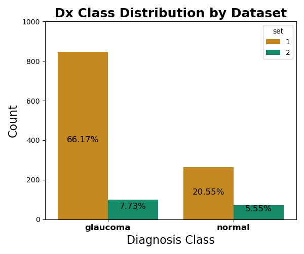
  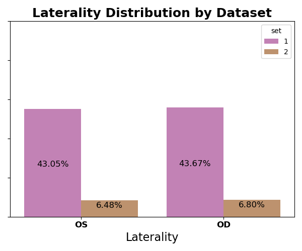
</div>
#### Addressing the Diagnostic Class Imbalance
While having balanced classes in a dataset is a general gold-standard in machine learning, some arguments in favor of keeping the dataset as is (and potential explanations as to how the original authors were able to achieve good results with this set) include:

+ **Glaucoma is an Edge-Case**: the particular binary classification problem of interest here is that of detecting the presence or absence of a *rare / edge-case*.  That is, despite how devastating the disease can be when identified late or left untreated, glaucoma technically represents a minority of the general population.  Thus, it may be more crucial for the sake of training a CNN to provide many more examples of this "edge-case."
+ **The Positive Class is More Heterogenous**: there could be more variation in anatomical features that would constitute an OCT scan of an eye with glaucoma as compared to one that was normal/healthy.  In this case, a CNN would likely need to see more examples of all the different varieties of image features that would increase suspicion of glaucoma, while it would only need a few examples of a normal eye to extract the key image features shared by all such cases.

Considering these rationales were not explicitly stated in the original paper, it was decided for this project that an additional balanced dataset would be prepared during pre-processing in order to test against the original unbalanced dataset during modeling.

### 3.2 Volume/Image Characteristics

#### 3.2.1 - Visualizing Image Data (3D Volumes & 2D B-Scan Frames)

<u>3D Volume Visualization</u>
Sample of orthogonal central slices visualized for a single OCT Volume (i.e., single datapoint from from SET 1) - i.e., each image represents the middle slice along each axis of the 64x128x64 3D NumPy array.  The middle image is fairly recognizable as being a slice in roughly the same plane as the retina itself (i.e., similar to a circumpapillary scan), while the other two were identified to either be along the transverse / sagittal planes, cutting right through the center of the optic disc/cup. 
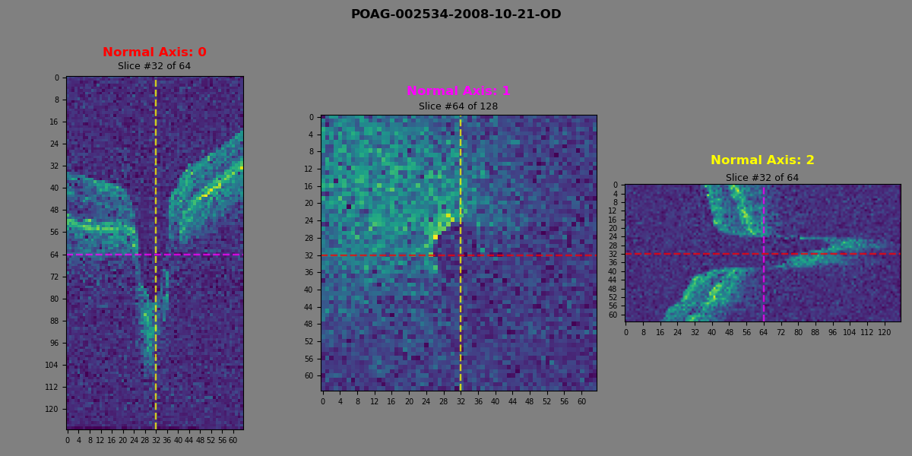

<u>2D B-scan Visualization</u>
Sample of the different 2D images associated with a single patient (Patient #3); the left column includes different B-scan frames of either the left (OS) or right (OD) of the patient, while the other two columns represent that associated masks/boundaries for the optic cup and disc regions for the B-scan frame in the same row.  Of note, some B-scan images had such regions (particularly the optic cup region) shaded in blue, while others did not, for whatever reason.  In other cases (not shown here), the accompanying mask/boundary image was not provided or missing but the region was still shaded in.  

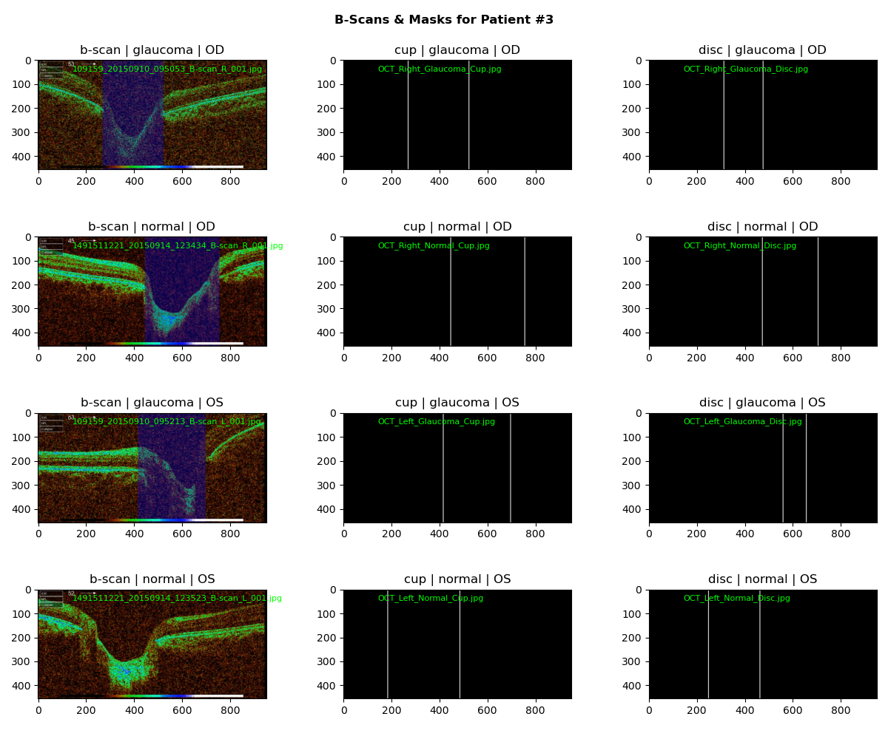

Keeping in mind the possibility of combining datasets, it was noted that the optic cup regions of such B-scan frames were similar in appearance to the slice of the 3D Volume in the previous figure on the left (axis 0).  Thus, part of the pre-processing might include extraction of slices along this plane from the 3D Volumes in addition to cropping down the 2D B-scan images to the optic cup region either using the shaded regions or horizontal coordinates obtained from the mask/boundary images, depending on what was available. 

> **Additional Note Regarding SET #2:** *this dataset was also noted to include video files (`.wav`) which were reviewed and found to represent a run-through of all the frames in given scan at different levels of depth.  It was noted that the individual video-frames could theoretically be extracted into constituent 2D images (e.g., using `ffmpeg`), converted into NumPy arrays, and potentially used to reconstruct a 3D OCT Volume-equivalent in the case that a combined 3D dataset was of interest, rather than a combined 2D one.  However, this route was ruled out for now given the paucity of such data (only two such video files were provided).  Nevertheless, such an idea is noted here in the case that newer editions of this dataset are released in the future with additional data of this type.*

#### 3.2.2 - Distributions of Array Dimensions (H,W,D)

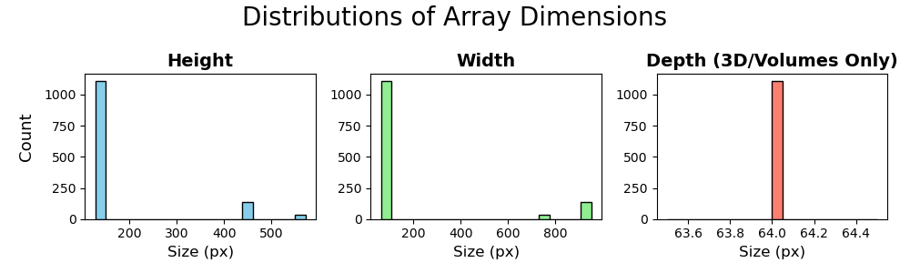
As all of the 1110 3D Volumes (SET 1) were already of shape (H,W,D) = (64,128,64), this contributed to the tall bars seen in all three plots.  The 2D B-scan frames (SET 2) were treated as lacking a depth dimension, and instead only contributed to the height and width distribution plots, with distinct and much shorter bars in the higher/far-right regions of size.  The shorter height of these bars suggest that
1. Combining the addition of SET 2 to SET 1 might not provide significantly much more data compared to SET 1 alone, and perhaps would worsen results if the datasets are not particularly compatible.
2. If combining the datasets is ultimately pursued, both cropping and down-sampling of the B-scan images will likely be required to match the dimensions of the slices extracted from 3D volumes.
#### 3.2.3 - Distributions of Pixel Intensities 
Pixel intensity histograms were visualized for various data points.  Nine of such histograms for each dataset (total of 18) are shown here to give an idea of their general appearance:

<u>Pixel Intensity Histograms for 3D Volumes</u>
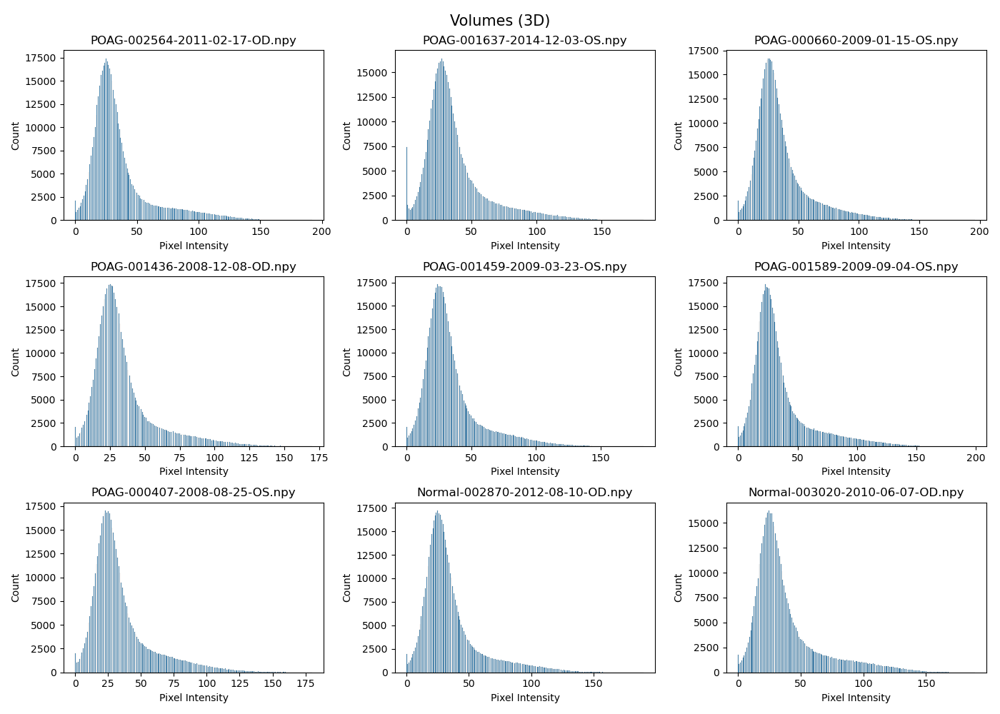
<u>Pixel Intensity Histograms for 2D B-scan frames</u>
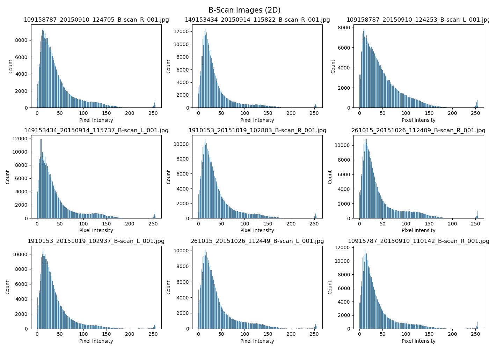

In both cases, the distribution was noted to be right-skewed with some slight irregularities (i.e., the curve wasn't entirely smooth in some areas).  These deviations from normality were understood to primarily represent image features, and that such histograms would represent meaningless noise in the case that the distribution well-approximated a Gaussian PDF. That said, the histograms for SET 2 (2D B-scans) were noted to be consistently different from that of SET 1 (Volumes), including small but consistent peaks in the higher intensity range and more pronounced right-skewing.  Both differences were attributed to some aspects of the 2D images, including the color-bar/legend included at the bottom which consistently make every image have both additional dark pixels (i.e., additional right-skewing) due to the black region to the left of the bar along with additional bright pixels (i.e., small peaks to the right of the histogram) due to the white region to the left of the bar.  Such differences were predicted to resolve following pre-processing, during which such image artifacts will be removed or cropped out in some way.  
## 4. Pre-Processing

In this section, we:
+ Performed one-hot encoding (binary object –> binary numeric) of:
	+ Target: dx_class (glaucoma or normal) –> `glaucoma` (1 or 0)
	+ L vs. R eye: `laterality` (OS or OD) –> `left_eye` (1 or 0)
+ Created proxy patient identification numbering for combined set: – patient_id (object) –> PIN (object)
+ Processed 2D B-scans to match volume slices, including: – Cropping images down to the optic cup region
	+ using masks images where available
	+ for those without masks, used shaded regions for cropping 57
	+ dropped scans with neither masks nor shaded region (31 images, with 48 of the original 79 bscan images leftover) – Downsampling images to 64x128px – Unshaded any shaded images using average color channel differences – Converted images to grayscale
+ Extracted slices of volumes to match the processed B-scans
+ Combined 2D images (processed B-scans and volume slices) into single set
+ Normalized pixel intensities of all images in both the composite 2D image set (cdf) and the original volume set (voldf).
+ Performed train-test split on both sets, keeping the target feature with the others for now.
+ Saved train and test sets to csv files as seen in previous code cell.


> **NOTE:** *although such code is technically included in the `modeling.ipynb` (as it wasn't decided upon until this step), pre-processing also involved creating a class-balanced version of the 3D Volumes Dataset (SET #1) by randomly sampling from the positive class (glaucoma) only enough data points to match the size of the negative class (healthy).  The result was a dataset with fewer data points than the original SET #1, but with a 50/50 split between Glaucoma/Normal volumes rather than an "over-representation" of Glaucoma volumes.*

## 5. Modeling

At this point, it was decided in the interest of time to focus on only the first dataset (ONH-centered OCT volumes), while leaving the combined 2D dataset up to further work in the future.  The following were carried out in this section:
1. Replicated & trained the final CNN model architecture reported by the original authors of the dataset.
2. Trained a ResNet-Like architecture using the same data.
3. Trained an attention-based architecture using the same data.

As noted earlier, a balanced version of SET 1 was also created and tested against the original unbalanced dataset (i.e., to see whether having equal proportions of Glaucoma and Healthy classes but fewer data points overall would help or harm model performance compared to having more Glaucoma datapoints).
### 5.1 Model Architectures

<div style="text-align: center;">
  <div style="display: inline-block; text-align: left;">
    <a href="https://journals.plos.org/plosone/article?id=10.1371/journal.pone.0219126">
      Figure 1
    </a>
    <b>: The Original 3D CNN Architecture </b>
    <br>
    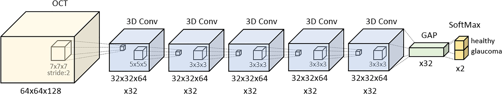
      <br>
      Diagram of the original sequential architecture used by the authors, as used in their <a href="https://journals.plos.org/plosone/article?id=10.1371/journal.pone.0219126">
      publication
    </a> .
  </div>
</div>

---

Note: for the following layered model architecture diagrams, the `ReLU` and `BatchNormalization` layers have not been included for the sake of neatness; however, it can be assumed that every `Conv3D` layer (cyan) outputs to a `BatchNormalization` which then outputs to a `ReLU` layer prior to whatever layer follows it in the diagram.

Here, we define three different model architectures using the functional API in Keras/TensorFlow.

+ **MODEL 1 :**  *An attempt at replicating the original model, as described in the original paper.*

    + Defined within `buildSequential()`

	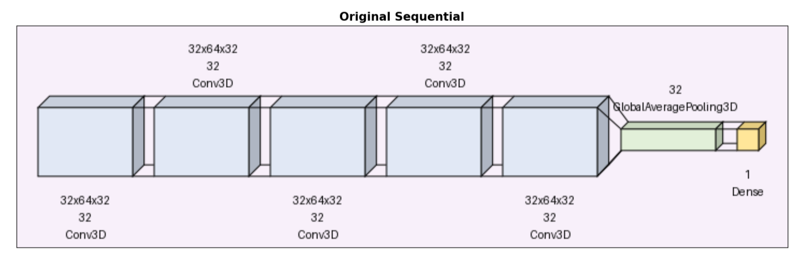

	As seen in the figure, the model is composed of five sequentially placed convolutional layers.  Additionally, the filter sizes are 7-5-3-3-3, for each of the convolutional layers, respectively.  Of note, the final dense layer differs from the original authors' version in that it has only a single output rather than two; while the original authors had done this for the sake of using a **softmax** activation function and producing Class-Activation Maps (CAMs) after training, the **sigmoid** activation is more commonly used with binary classification problems such as this one.
---

+ **MODEL 2 :**  *A ResNet like architecture, building upon some of the basic elements of Model 1, but with the introduction of a **residual block**.*

    + Defined within `buildResNet()`

	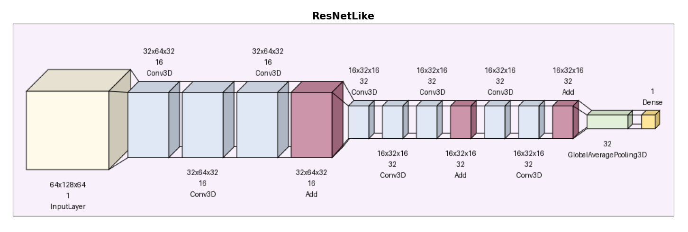

---

+ **MODEL 3 :**  *An attention-based architecture, building upon the previous two models, that utilizes both **squeeze-excitation** and **spatial-attention** blocks.*

    + Defined within `buildAttnNN()`

	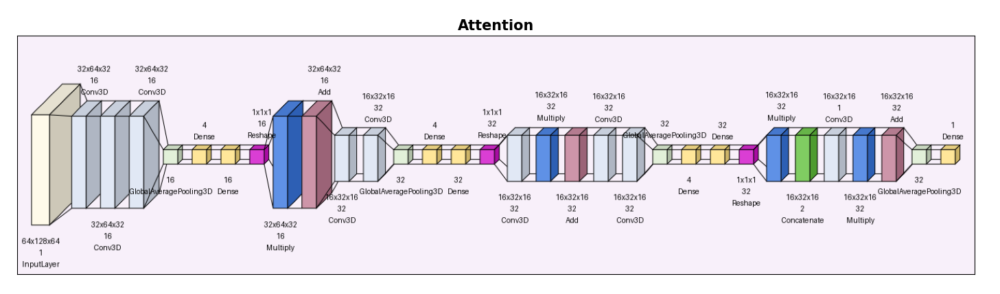

---

### 5.2 Training Results/Findings

<div style="text-align: center;">
  <div style="display: inline-block; text-align: left;">
    <h4>5.2.1 Precision, Recall, and F1 Scores</h4>
        
    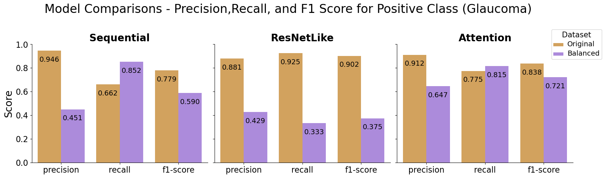
      
      <br>
      The figure shows how each architecture performed, with the original unbalanced dataset and the balanced datasets, on the metrics of precision, recall, and f1 score for the positive class (i.e., the presence of Glaucoma).
      
  </div>
</div>

<div style="text-align: center;">
  <div style="display: inline-block; text-align: left;">
    <h4>5.2.2 Confusion Matrices</h4>
        
    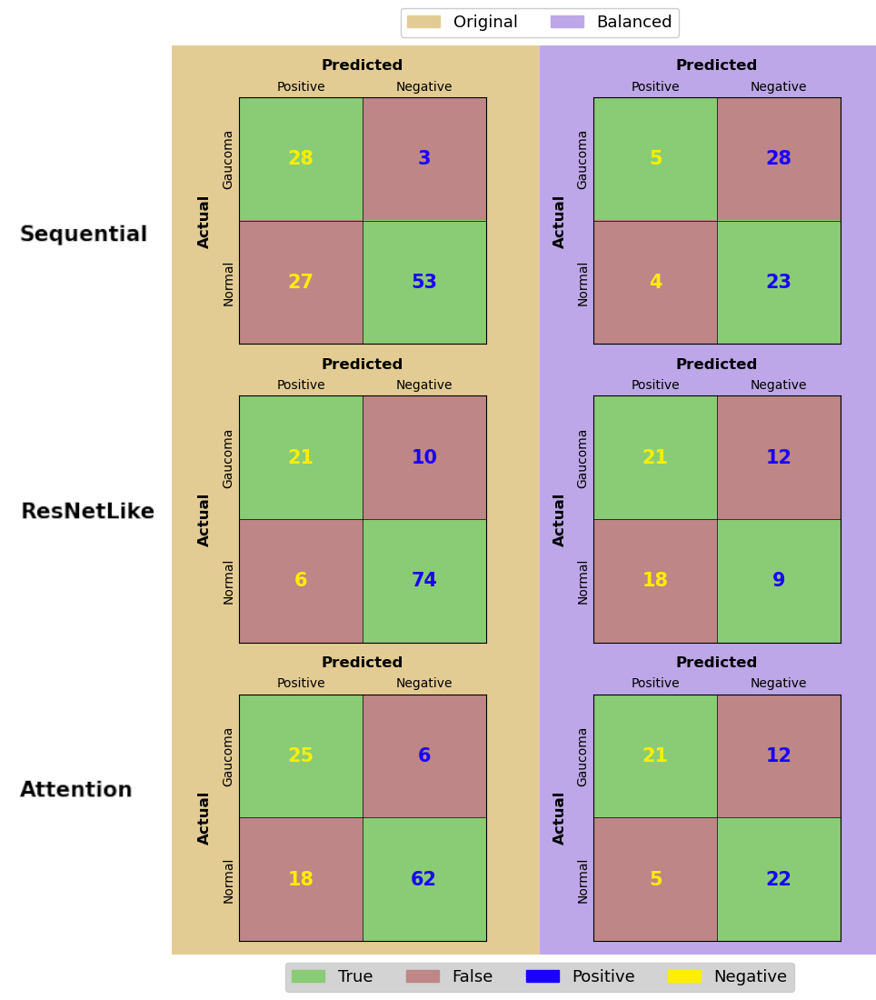
      
      <br>
      The confusion matrices plotted for each of the 6 models resulting from two datasets (Original, Balanced) and three architectures (Sequential, ResNetLike, Attention).
      
  </div>
</div>

---

<div style="text-align: center;">
  <div style="display: inline-block; text-align: left;">
    <h4>5.2.3 AUC and Training Time</h4>
        
    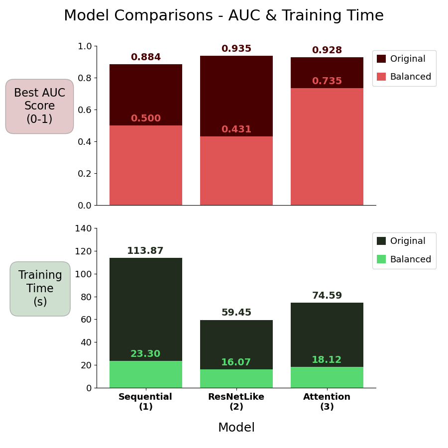
      
	  <p alt="Description" width="40%" style="text-align: left; size: 5">
  
	  <b>AUC Score</b>
	  <br>
	  When using the dataset with a balanced diagnostic class distribution (equal amounts of glaucoma-positive and normal/healthy), the original sequential architecture was still able to make predictions not attributable to a mere coin toss, but albeit at a somewhat worse AUC than when trained with the original unbalanced dataset.
	  <br><br>
	  Interestingly, the other two architectures would appear to have diverging results when trained on unbalanced and balanced datasets, respectively.  That is, when trained on the original unbalanced set, they both perform quite similarly and better than the sequential architecture.  However, when trained on the balanced set, they both similarly seem to be incapable of distinguishing anything whatsoever (AUC ~0.5).
	  <br><br>
	<b>Training Time</b>
	<br>
		Taking into account the training times as well, it would seem that while the AUC scores for the ResNetLike and Attention models trained on the original set were very similar and both an improvement from the Sequential, the ResNetLike model trained in a little over 1/2 the time the Sequential did while the Attention model took a little less than 3/4 of that time.
		  
	</p>
      
  </div>
</div>

<div style="text-align: center;">
<div style="display: inline-block; text-align: left;">
    <h4>5.2.4 Training Histories</h4>
    
	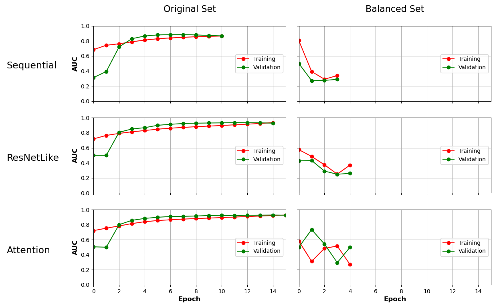
	
	<p>
	Upon inspecting the training histories over epochs, it would seem that when using the balanced datasets, the AUC would often drift downward until early stopping kicked in, suggesting a vanishing gradient of some sort.  As creating the balanced dataset from the original ultimately meant a reduction in the overall size, the vanishing gradient may have been related to this and a resulting mismatch with the hyper-parameters that had already been tuned to fit the original dataset.  Nevertheless, as the original dataset produced fairly good results despite being unbalanced, the models trained on these datasets were thus prioritized, with the option for further hyper-parameter tuning left up to future project directions.   
	</p>
</div>
</div>

### 5.3 Discussion & Conclusions

#### 5.3.1 Final Model Selection
It is clear based on the AUC scores that both the ResNetLike and Attention models trained on the original, unbalanced dataset performed the better than the Sequential when applied to the evaluation set.  However, between the two of them, with scores of 0.935 and 0.928, respectively, it is hard to say if the slightly better score of the ResNetLike model truly represents better performance, or that such a small difference could be more attributable to random chance.  Nevertheless, when accounting for the training times, it can at least be said that the ResNetLike model is slightly less time-inefficient, and therefore was selected as the final model.
#### 5.3.2 Model Metrics Files

All training data / performance metrics used to generate the plots in the previous section were saved to `.json` files during training, located at 

```OCTCV/p5_Modeling/models/<model-name>/<model-name>.json```
#### 5.3.3 Future Directions

**Hyper-parameter Tuning**
It is important to note that since the hyper-parameters for training (e.g., learning rate) had been tuned and provided by the original authors of Dataset #1, no hyper-parameter tuning had been done for the models trained in this project.  While keeping the same hyper-parameters for the two alternate architectures yielded fairly good results, performing tuning for these two architectures in the future may potentially yield even better results in the case that such hyper-parameters are architecture-specific.  Additionally, such tuning may potentially help to avoid the "vanishing gradients" seen in all cases where the balanced dataset was used.

**Attempting a 2D CNN**
As the combined 2D set was created during pre-processing, and as noted earlier in this document, it may be of interest in the future to test out the combined 2D set in training a more lightweight 2D CNN instead of requiring a 3D one.

## 6. Notes & References

### 6.1 Source-Code

The majority of the code is located inside of jupyter notebooks of the repo, organized in folders by the various steps of the project.  Additionally, some custom modules where written to assist with some steps, saved as python files in `OCTCT/octcv/`
#### Custom Modules

`octcv/ArrViz.py`
`octcv/mdl_lib.py`

### 6.2 References & Credits

[1] Ishikawa, H. (2018). *OCT volumes for glaucoma detection* (Version 1.0.0) [Data set]. Zenodo. https://doi.org/10.5281/zenodo.1481223

[2] Maetschke, S., Antony, B., Ishikawa, H., Wollstein, G., Schuman, J., & Garnavi, R. (2019). A feature agnostic approach for glaucoma detection in OCT volumes. *PLOS ONE*, 14(7), e0219126. https://doi.org/10.1371/journal.pone.0219126

[3] Hassan, T., Akram, M. U., & Nazir, M. N. (2021). *A Composite Retinal Fundus and OCT Dataset with Detailed Clinical Markings of Retinal Layers and Retinal Lesions to Grade Macular and Glaucomatous Disorders* (Version 4) [Data set]. Mendeley Data. https://doi.org/10.17632/trghs22fpg.4

[4] Hassan, T., Akram, M. U., Masood, M. F., & Yasin, U. (2018). Deep structure tensor graph search framework for automated extraction and characterization of retinal layers and fluid pathology in retinal SD-OCT scans. *Computers in Biology and Medicine*, 103, 58–68. https://doi.org/10.1016/j.compbiomed.2018.10.017

[5] Hassan, T., Akram, M. U., Werghi, N., & Nazir, M. N. (2020). RAG-FW: A hybrid convolutional framework for the automated extraction of retinal lesions and lesion-influenced grading of human retinal pathology. *IEEE Journal of Biomedical and Health Informatics*, 24(3), 792–802. https://doi.org/10.1109/JBHI.2019.2917361

---
---
